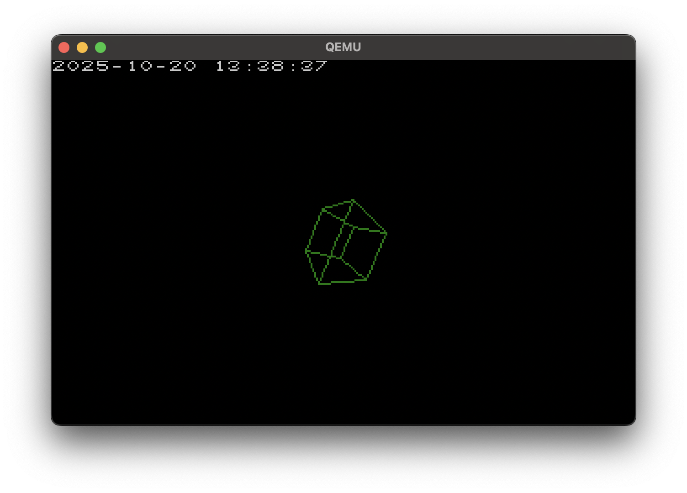

# mboot
mboot is a minimal os for i386 platforms.

## Prequisites
Building mboot depends on:
 - llvm tools (clang, ld.lld)
 - nasm

Running mboot needs:
 - the building tools or a disk image
 - qemu-system-x86_64

## Building
Note: inside the makefile there is a line appending a macro definition to `CFLAGS`. Edit the macro's value to bundle different demos to run on boot
```sh
make
# normal os
qemu-system-x86_64 -m 4G -drive file=image.img -serial stdio

# with networking enabled
qemu-system-x86_64 -m 4G -drive file=image.img -serial stdio -device e1000,netdev=n0 -netdev user,id=n0 -object filter-dump,id=f1,netdev=n0,file=netdump.pcap
```

## Demo options
Demo options include:
- `CUBE_DEMO`
- `TIME_DEMO`
- `E1K_DEMO`
- `IMF_DEMO`
- `PSF_DEMO`

## Note
As filesystems and elf files aren't implemented yet, programs you want to launch from mboot need to be linked into it and called from `loader.c`

## todo:
- [x] 32 bit protected mode
- [x] cpu exceptions
- [x] individual hardware interrupts
- [x] a ps/2 keyboard
- [x] vga in 320x200x8bpp
- [x] reading ata drives
- [x] rs232 interfaces
- [x] the intel 8259 PIC
- [x] the intel 8253 PIT
- [x] the mbr partitioning scheme
- [x] wad files as the filesystem
- [x] enable x87 fpu
- [ ] memory allocator
- [ ] elf loader
- [ ] paging
- [ ] libc

## Screenshots

